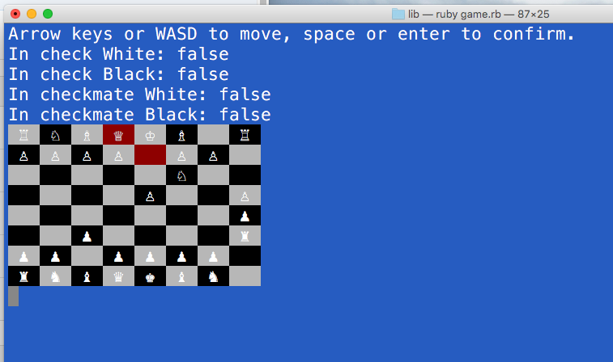

# Chess - Ruby

This repository contains a fully back-end, object-oriented game of chess, written in Ruby.

Ruby must be installed on your machine to run this program.  To do so, simply download this repo, cd into the `lib` folder in your terminal, and type `ruby game.rb`.  Enjoy!

## Features

This game enforces the movement directions and patterns of each piece in chess, allowing the user to make only valid moves.  A base `pieces.rb` class provides the basic functionality for the chess pieces, and two modules, `Slideable` and `Stepable`, provide additional guidance to the biship, queen, and rook, and to the king, knight, and pawn, respectively.

Each turn, the game checks whether either the white or black player are in check, invalidating moves that would either leave them in or newly put them in check.  White (on top) makes the first move, and play alternates between black and white after that.

## Future development

This game is a work in progress.  Future features include:

* Cursor highlighting of all valid moves once a piece is selected
* AI for a computer player
